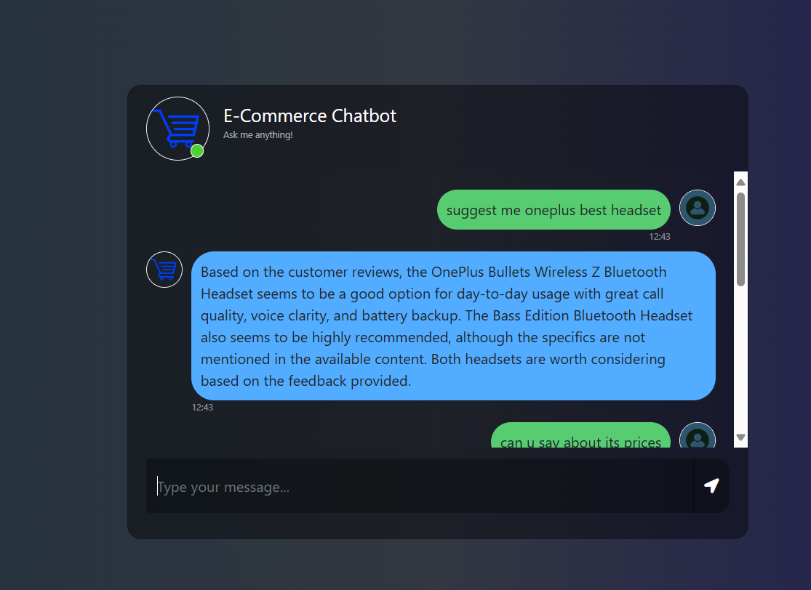
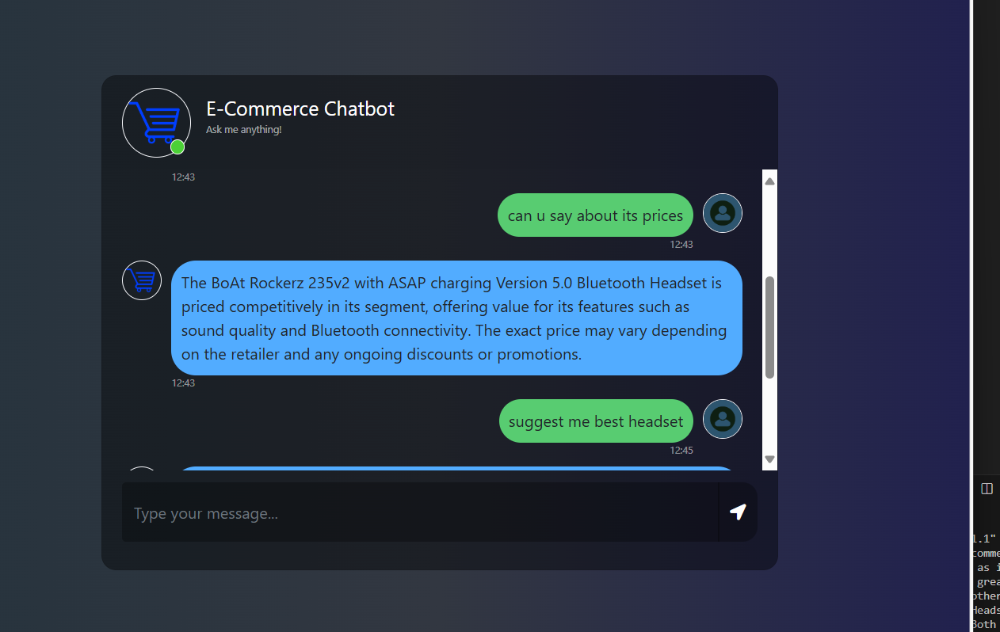

# 🚀 E-Commerce Chatbot using RAG (LangChain + OpenAI + AstraDB)

A powerful, intelligent chatbot built for answering e-commerce product-related queries using **Retrieval-Augmented Generation (RAG)**. Leveraging **LangChain**, **OpenAI Embeddings**, and **AstraDB**, this solution is optimized for handling headset and earbud product data from Flipkart. The chatbot is deployed via **Flask** on **AWS EC2**, offering a sleek web interface for real-time interaction.




---

## ✨ Features

- 💡 **Intelligent Q&A system** powered by LLMs  
- 🔍 **Semantic product search** via OpenAI embeddings  
- ⚡ **Fast vector similarity** with AstraDB  
- 🌐 **Real-time web UI** using Flask  
- ☁️ **Fully deployed on AWS EC2**

---

## 🧰 Tech Stack

| Component     | Description                                         |
|---------------|-----------------------------------------------------|
| OpenAI        | Embedding generation for product descriptions       |
| LangChain     | RAG pipeline for retrieval and response generation |
| AstraDB       | Cloud-based vector database for semantic search     |
| Flask         | Web application (frontend and backend)              |
| AWS EC2       | Hosting and deployment                              |
| Flipkart Data | Sample product dataset (headphones, earbuds)        |

---

## 📁 Project Structure

```plaintext
ecomm-chatbot/
├── app.py                       # Flask entry point
├── requirements.txt             # Python dependencies
│
├── data/
│   └── flipkart_products.csv    # Product dataset
│
├── ecombot/                     # Core chatbot modules
│
├── templates/
│   └── chat.html                # HTML UI for chatbot
│
├── static/
│   └── style.css                # UI styling
│
├── images/                      # Demo screenshots
│
└── README.md
```

---

## ⚙️ How It Works

1. Product data is parsed and chunked into documents.  
2. OpenAI creates embeddings for each document.  
3. Embeddings + metadata are stored in AstraDB.  
4. LangChain retrieves the most relevant chunks.  
5. An LLM generates a response based on context.  
6. Flask displays the response in the browser.

---

## 🧪 Running Locally

Install dependencies:

```bash
pip install -r requirements.txt
```

Run the Flask server:

```bash
python app.py
```

Open your browser and go to: [http://localhost:5000](http://localhost:5000)

---

## 🚀 Deployment

- ✅ Deployed on **AWS EC2**  
- 🗃️ Uses **AstraDB** for vector search  
- 🧠 Powered by **OpenAI** for response generation  
- 🐳 Ready for **Docker** containerization

---

## 🔮 Future Enhancements

- 🎙️ Voice input support  
- 🛒 Multi-category product handling  
- 📚 Chat history and session tracking  
- 🎯 Query filters (e.g., brand, price, rating)

---
